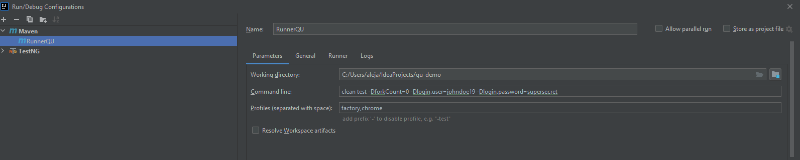
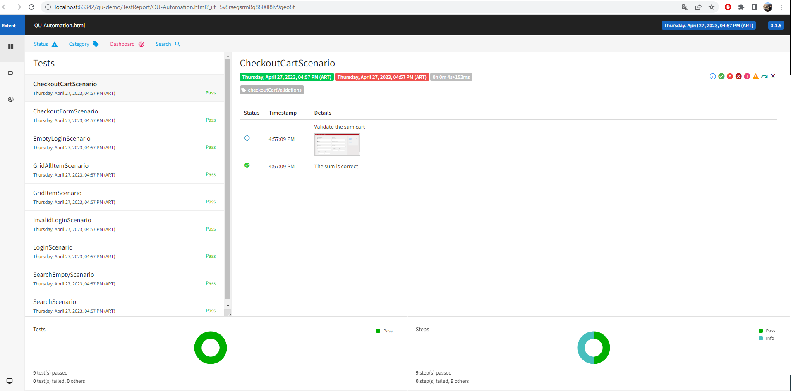

## Notes
In the case that if the alert is present at checkout, it was resolved in the case of CheckoutFormScenario. If you are present, accept it, click the checkbox and continue

## How To Run It
Execute that maven command:
```
mvn clean test -DforkCount=0 -Dlogin.user=johndoe19 -Dlogin.password=supersecret
```
And the Profiles

```
factory,chrome
```

Example 


## Configuration
1) Pull the docker image containing the web app docker pull automaticbytes/demo-app

2) Run the image docker run -p 3100:3100 automaticbytes/demo-app

3) Verify the app is shown in below url and set it as the base url for the tests. http://localhost:3100

## Report

The report will be found in the framework path in the TestReport folder

Report Example 
# Project structure

## Tools :
+ Selenium
+ Maven
+ Java8
+ ExtentReport
+ SDK 16

## Structure :
```

├── main
│   ├── java
│   │   └── qu
│   │       └── actions
│   │           ├── CheckoutActions
│   │           ├── CommonActions-(Commons fuctions)
│   │           ├── GridActions
│   │           ├── HomeActions
│   │           ├── LoginActions
│   │           ├── SearchActions
│   │       └── context
│   │           ├── ContextData
│   │           ├── HeadersEnums-(Have the header columns name for search)
│   │           ├── ScenarioContext-(Save localy the variable so we can use it in all the suite)
│   │           ├── ScenariosKeys
│   │       └── core
│   │           ├── DriverService-(Create and close the driver)
│   │           ├── ProjectType-(Call the type of Driver Chrome-Firefox-Edge)
│   │           ├── PropertyManager-(Take the propertis from config.properpies)
│   │           ├── TestFactory-(It is the core of the project where all the tests to be executed are placed) 
│   │           ├── TestListener-(They are the hooks. Here are all the pre and post execution functions)
│   │       └── data
│   │           ├── data.json
│   │       └── extentReport
│   │           ├── ExtentManager-(Create the report instance)
│   │           ├── ExtentTestManager-(Place all the tests in the same instance, with their respective images)
│   │       └── pages
│   │           ├── checkoutPages
│   │           ├── gridPages
│   │           ├── homePages
│   │           ├── loginPages
│   │           ├── pagecommons-(Here are all the selenium functions such as clicks, inputs, etc)
│   │           ├── searchPages
│   │       └── scenarios
│   │           ├── CheckoutCartScenario
│   │           ├── CheckoutFormScenario
│   │           ├── EmptyLoginScenario
│   │           ├── GridAllItemScenario
│   │           ├── GridItemScenario
│   │           ├── InvalidLoginScenario
│   │           ├── LoginScenario
│   │           ├── SearchEmptyScenario
│   │           ├── searchScenario
│   │           ├── TestScenario-(Here is the configuration of the scenarios before their execution or post execution)
│   └── resources
│       ├── config.properties